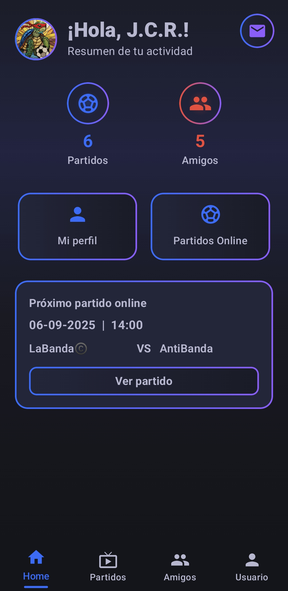
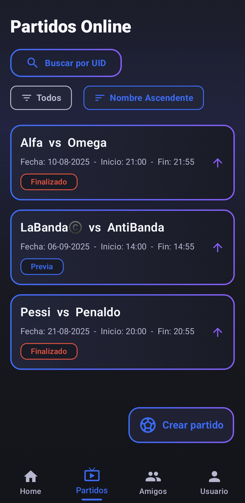
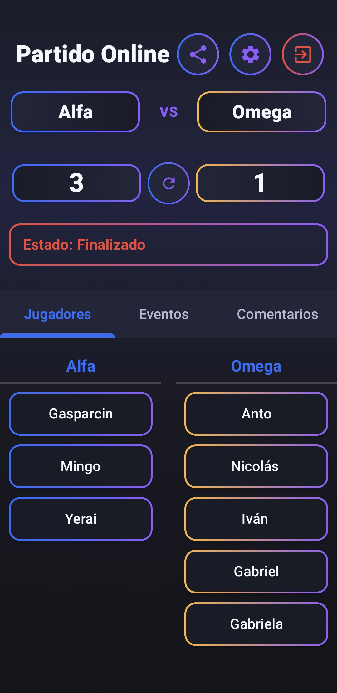

# TorneoYa ⚽  

**TorneoYa** es una aplicación para Android que te permite organizar y unirte a partidos de fútbol con tus amigos de forma rápida y sencilla.  
Lleva el marcador en tiempo real, comenta, vota encuestas y consulta estadísticas básicas de tus partidos.  

  

---

## ✨ Características  

- 📅 **Organiza partidos** en segundos: fecha, hora y visibilidad.  
- 👥 **Conecta con amigos y grupos** para tener siempre tu equipo listo.  
- ⚽ **Marcador en vivo** con goles y asistencias por jugador.  
- 🏆 **Estadísticas básicas**: MVP, goles y partidos jugados.  
- 💬 **Comentarios y reacciones** rápidas durante los partidos.  
- 📊 **Encuestas** para decidir al mejor jugador o votar jugadas polémicas.  
- 🎨 **Interfaz cuidada**, sin anuncios ni compras integradas.  

---

## 📲 Descarga  

- 🔽 [APK directo (última versión)](https://github.com/MingosGit/TorneoYa/releases/latest/download/TorneoYa1.0.apk)  
- 📦 Pronto en **Google Play**  

---

## 🚀 Tecnologías utilizadas  

- **Android 10+** con **Kotlin**  
- **Jetpack Compose** para la interfaz  
- **Firebase** para notificaciones y sincronización  
- **Material 3** + paleta de diseño propia  

---

## 🌐 Página oficial  

👉 [mingosgit.github.io/TorneoYa](https://mingosgit.github.io/TorneoYa)  

---

## 📸 Capturas  

*(Ejemplos de pantallas de la app, añade tus imágenes en `/screenshots`)*  

| Inicio | Lista de partidos | Estadísticas |
|--------|------------------|--------------|
|  |  |  |  

---

## 🤝 Contribuir  

1. Haz un **fork** del proyecto  
2. Crea una rama: `git checkout -b feature/nueva-funcionalidad`  
3. Haz commit: `git commit -m 'Agrego nueva funcionalidad'`  
4. Haz push: `git push origin feature/nueva-funcionalidad`  
5. Crea un Pull Request  

---

## 📜 Licencia  

Este proyecto está bajo la licencia **MIT**.  
